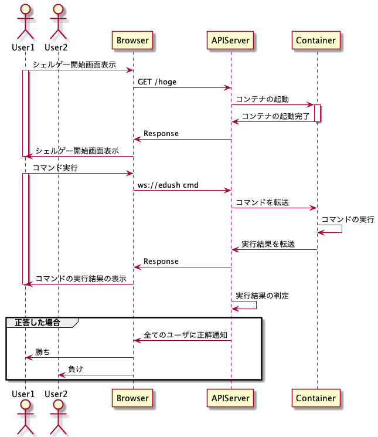

# edush

## シーケンス図(雑)
- シェルっぽい画面からwebsocketでコマンドを送信する。

## 実現の課題点
- ユーザーアカウントの作成
- 対戦の実現
    - 最終的には1対1
    - 今は一人でゲームができる状態にする。
- その他
    - セキュリティ
       - 権限の制限
    - パフォーマンス
        - コンテナぽこぽこ立てて大丈夫なもんなのかな

## とりあえずの方向
### フェーズ1
コマンドを送信して、判定結果が返ってくるまでの流れを作成する。
- [x] コードからDockerコンテナを操る
- [x] websocketからコマンドをコンテナに送信
- [x] 文字列一致による簡単なjudgeを作成

### フェーズ2
ユーザーの識別
- [] ログイン等の機能の作成
- [] ユーザごとにコンテナを与える実装

### フェーズ3
ゲームとしての機能を検討する。