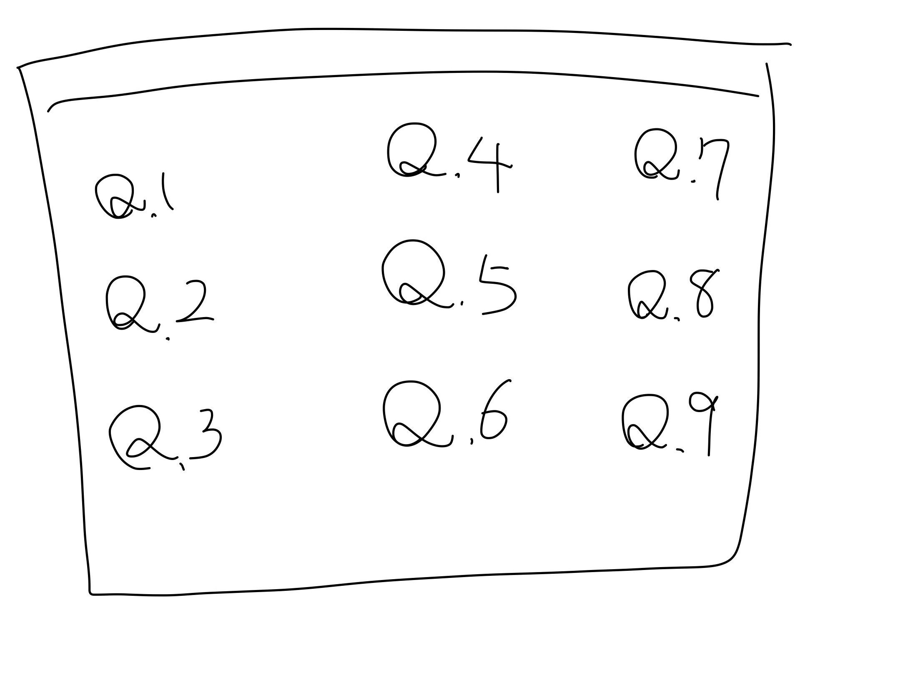
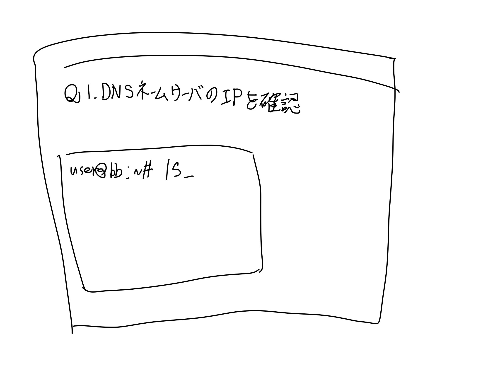

# ROUTER

## devメモ

**問題一覧画面**

問題形式にするなら。
対戦形式にするなら別の何かを考える。

**問題例**
問題とshellっぽい画面
ルームIDから一意のアドレスを生成する。

## シーケンス図(雑)
- シェルっぽい画面からwebsocketでコマンドを送信する。

## 実現の課題点(見えていない点)
- ユーザー登録はめんどくさいので後回し。
- どうやってユーザを部屋に招くか。
    - 現時点では「ルームID発行→一意のurl提供」を想定
- どうやってコマンドを実行するか。
    - ルームIDごとにコンテナを作成？(ここが一番見えてない。)
- その他
    - セキュリティ
       - 権限の制限
    - パフォーマンス
        - コンテナぽこぽこ立てて大丈夫なもんなのかな

## とりあえずの方向
### フェーズ1
コマンドを送信して、判定結果が返ってくるまでの流れを作成する。
- websocketからコマンドを送信を実装
- ユーザーそれぞれに異なる仮想環境を与える
- 文字列一致による簡単なjudgeを作成

### フェーズ2
ユーザーの識別をして、誰が勝ったかわかるようにする。
- 正答したユーザにwin,その他のユーザにlooseを送信する。

### フェーズ3
ユーザのコマンドをどこで実行させるのかを検討する。
- ルームに適応したコンテナを生成し、そちらのシェルで実行させたい。
    - 実現方法がイメージできないので要調査

### フェーズ4
問題を増やす。
UIとかは一番最後でいいかな。